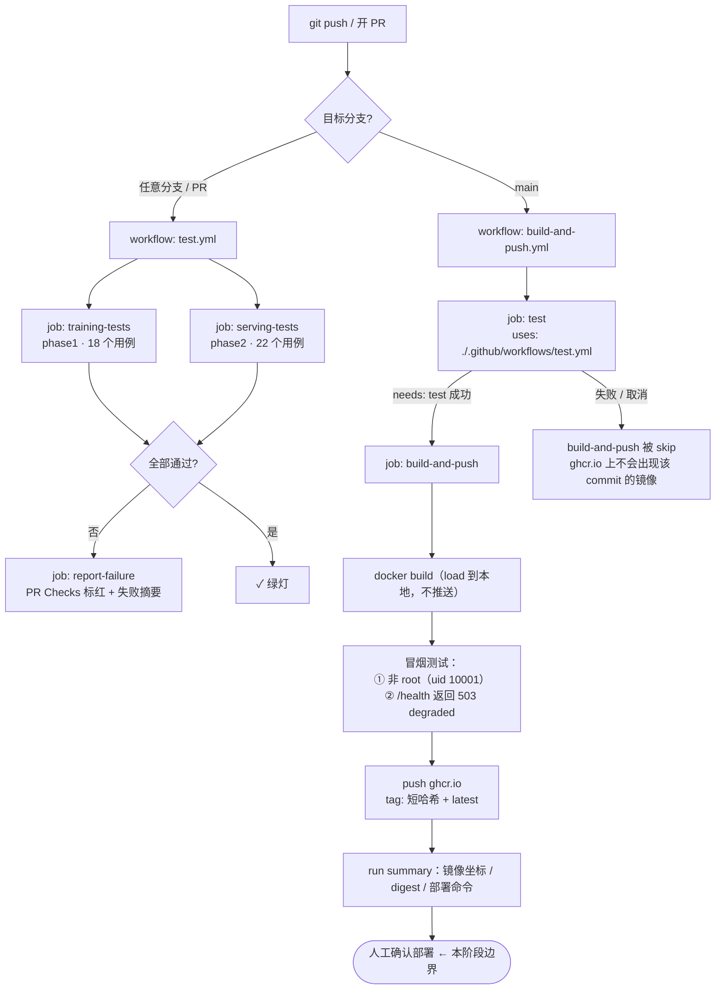

# MLOps 全链路学习项目

从「能训练」到「能交付」的分阶段实践。每个阶段都有独立文档，也共用同一份特征契约与同一条流水线。

| 阶段 | 目标 | 产出 | 文档 |
| --- | --- | --- | --- |
| Phase 1 | 训练可追踪、结果可复现 | `train.py` / `load_and_predict.py`，MLflow 本地追踪，git commit 绑定 | [phase1-mlops/README.md](phase1-mlops/README.md) |
| Phase 2 | 容器化推理服务，消除 training-serving skew | FastAPI 服务 + 多阶段构建镜像（721 MB / 压缩 149 MB） | [phase2-mlops/README.md](phase2-mlops/README.md) |
| Phase 3 | 提交即测试、主干即构建推送 | GitHub Actions 两条 workflow + ghcr.io 镜像 | 本文档「CI/CD 流程说明」 |
| Phase 4 | 系统监控 + 模型监控双重可观测 | Prometheus + Grafana（两份 dashboard）、Evidently 漂移报告 | [phase4-mlops/README.md](phase4-mlops/README.md) |

## 仓库结构

```
MLOps project/
├── .github/workflows/
│   ├── test.yml               # workflow 1：任意分支 push / PR → 跑 phase1+phase2 测试
│   └── build-and-push.yml     # workflow 2：main 分支 → 测试通过后构建并推送镜像
├── shared/                    # 训练与服务共用的特征契约（可安装包 mlops-shared）
│   └── mlops_shared/{features,tracking,errors}.py
├── phase1-mlops/              # 训练：MLflow 追踪 + 可复现基线（18 个测试）
├── phase2-mlops/              # 服务：FastAPI + Docker（22 个测试）
├── phase4-mlops/              # 监控：/metrics 埋点 + Prometheus/Grafana + Evidently 漂移
├── .dockerignore -> phase2-mlops/.dockerignore
└── README.md                  # 本文档
```

## 快速开始（本地）

```bash
# 1. 训练一个模型，拿到 run_id
cd phase1-mlops && python3 -m venv .venv && source .venv/bin/activate
pip install -r requirements.txt
python train.py --n-estimators 100 --max-depth 3 --random-state 42

# 2. 起推理服务
cd ../phase2-mlops && python3 -m venv .venv && source .venv/bin/activate
pip install -r requirements.txt -r requirements-dev.txt
export MLFLOW_TRACKING_URI="sqlite:///$(cd ../phase1-mlops && pwd)/mlflow.db"
export MODEL_URI=<上一步的 run_id>
uvicorn app.main:app --port 8000

# 3. 或直接用流水线产出的镜像（见下文「人工确认部署」）
```

---

# CI/CD 流程说明

## 流程图



## 两个 workflow 的职责

| | `test.yml` | `build-and-push.yml` |
| --- | --- | --- |
| 触发 | `push` 任意分支、`pull_request` 任意目标分支、`workflow_call` | `push` 仅 main、`workflow_dispatch`（手动补跑） |
| jobs | `training-tests`、`serving-tests`、`report-failure` | `test`（复用 test.yml）、`build-and-push`、`report-failure` |
| 失败后果 | 流水线终止；PR 无法合并（配好 branch protection 后） | 不推送任何镜像 |
| 产物 | 测试结论 + 失败摘要 | ghcr.io 镜像 + run summary 中的部署信息 |
| 边界 | — | **到推送镜像为止，不部署** |

### job 级说明

| workflow | job | 触发条件 | 作用 |
| --- | --- | --- | --- |
| test | `training-tests` | 每次 push / PR / 被调用 | 装 phase1 依赖（含 `-e ../shared`）并跑 18 个训练测试 |
| test | `serving-tests` | 同上 | 装 phase2 运行时+测试依赖并跑 22 个服务测试 |
| test | `report-failure` | `if: failure()` | 把「哪个 job 失败 + 本地复现命令」写进 run summary |
| build-and-push | `test` | main push / 手动 | 以 reusable workflow 形式复用上面全部测试 |
| build-and-push | `build-and-push` | `needs: test` 成功 | 构建 → 冒烟测试 → 推送 ghcr.io → 写部署摘要 |
| build-and-push | `report-failure` | `if: failure()` | 区分「测试没过」与「构建/推送失败」并给出排查方向 |

> phase1 和 phase2 的测试**必须分成两个 job**：phase1 装完整 `mlflow`，phase2 装
> `mlflow-skinny`，两者提供同一个 `mlflow` 包，装进同一个环境会互相覆盖。拆开既隔离
> 依赖又能并行。

## 依赖关系是怎么实现的

要求是「`build-and-push` 必须依赖 `test` 成功，用 job `needs` 机制，不用 sleep/轮询」。
GitHub Actions 的 `needs` 只能在**同一个 workflow 内**的 job 之间使用，所以做法是：

1. `test.yml` 额外声明 `on: workflow_call`，成为一个**可复用 workflow**；
2. `build-and-push.yml` 里用 `uses: ./.github/workflows/test.yml` 把它作为一个 job 引入；
3. 构建 job 写 `needs: test`。

```yaml
jobs:
  test:
    uses: ./.github/workflows/test.yml     # 同一份测试定义，不复制粘贴
    permissions:
      contents: read
  build-and-push:
    needs: test                            # ← 硬依赖，test 不成功就 skip
```

这样得到的行为：`test` 里任一 job 失败或被取消 → `build-and-push` 状态直接是
`skipped`，**不会**构建、不会推送。没有 `sleep`、没有轮询 API、也不用
`workflow_run` 去反查另一条 workflow 的结论（`workflow_run` 也能做，但它在
「区分 conclusion」「拿到正确的 commit」「fork PR 的权限」上更容易出错，而且测试定义
会散在两处）。

**已知取舍**：main 分支的一次 push 会跑两遍测试——一次是 `test.yml` 自己的 `push`
触发，一次是 `build-and-push.yml` 调用它。这是为了满足「任意分支 push 都有测试结论」。
若想省一半 CI 分钟数，把 `test.yml` 的 push 触发改成：

```yaml
on:
  push:
    branches-ignore: [main]   # main 由 build-and-push.yml 调用时覆盖
```

## 权限最小化

两个 workflow 都**显式声明** `permissions`，不依赖仓库默认值（默认可能是
read-write-all，属于过高权限）。声明后未列出的 scope 一律为 `none`。

| 位置 | permissions | 为什么 |
| --- | --- | --- |
| `test.yml` 顶层 | `contents: read` | 只需要 checkout 代码 |
| `build-and-push.yml` 顶层 | `contents: read` | 默认给最小，写权限下沉到具体 job |
| job `test`（调用方） | `contents: read` | 被调用的 workflow 继承调用方声明的权限 |
| job `build-and-push` | `contents: read` + `packages: write` | 唯一需要写权限的地方：推送镜像到 ghcr.io |
| job `report-failure` | `contents: read` | 只写 run summary |

其他收紧措施：

- `actions/checkout` 全部带 `persist-credentials: false`，不把 token 写进 `.git/config`；
- 每个 job 都有 `timeout-minutes`，卡死的 job 不会长期占用 runner；
- `concurrency` 让同分支的旧 run 自动取消（构建 job 例外，避免推送中途被杀）；
- `provenance: false`，不额外申请 `id-token` 之类的权限（需要供应链证明时再单独开）。

## 密钥管理（无任何明文）

- 推送 ghcr.io 用的凭据是 `${{ secrets.GITHUB_TOKEN }}`——由 Actions 在每次 run 开始时
  自动生成、run 结束即失效，**不需要人工创建，也不存在仓库任何位置**。
- 用户名用 `${{ github.actor }}`，同样是运行时上下文，不是密钥。
- workflow 文件里没有 PAT、没有密码、没有 registry token。自查命令：

  ```bash
  # 应只输出 secrets.GITHUB_TOKEN 这一处引用
  grep -rn "secrets\." .github/workflows/
  # 应无输出：常见密钥形态（GitHub PAT / 明文 password / base64 认证串）
  grep -rniE 'ghp_[A-Za-z0-9]|github_pat_|password: *[^$]|authorization: *basic' .github/ || echo "clean"
  # 应无输出：仓库里不该有 .env / 私钥
  git ls-files | grep -iE '\.env$|id_rsa|\.pem$|kubeconfig' || echo "clean"
  ```

- 将来真的需要自定义密钥（部署用的 SSH key、kubeconfig、Slack webhook）时：放
  **Environment secrets**（Settings → Environments → production → Secrets），只有绑定该
  environment 的 job 能读；配合 required reviewers 就同时有了「人工确认」。
- Actions 会自动把 secret 值在日志里 mask 成 `***`，但不要主动 `echo` secret，
  拼接/编码后的值不一定被 mask 到。

## 失败通知机制

失败会通过下面四个渠道显性暴露，不需要额外配置：

1. **PR 页面 Checks 区域**：`Phase 1 · training tests` / `Phase 2 · serving tests` 直接标红，
   点 "Details" 进到失败的那一步日志。若在 Settings → Branches 里把这两个 check 设为
   **required status checks**，PR 会被禁止合并。
2. **commit 状态标记**：commit 列表和 commit 详情页出现 ✗，main 上哪个提交把流水线搞红一眼可见。
3. **Actions 页面 + run summary**：失败的 run 标红；`report-failure` job 会在 summary 里写出
   「哪个 job 失败 / 影响是什么 / 本地怎么复现」，点通知链接进来就能看到下一步。
4. **邮件与站内通知**：GitHub 默认会就「你触发的 workflow 运行失败」给你发邮件和站内通知
   （可在 Settings → Notifications → Actions 调整，默认是 "Only notify for failed workflows"）。

想接 Slack / 飞书（本阶段未实现，避免引入来源不明的第三方 Action）：加一个
`needs: [...]` + `if: failure()` 的 job，用 `curl` 调 webhook 即可，URL 存在 Secrets 里：

```yaml
  notify-slack:
    needs: [test, build-and-push]
    if: failure()
    runs-on: ubuntu-latest
    steps:
      - run: |
          curl -fsS -X POST -H 'Content-Type: application/json' \
            -d "{\"text\":\"❌ ${GITHUB_REPOSITORY} ${GITHUB_REF_NAME} 流水线失败: ${GITHUB_SERVER_URL}/${GITHUB_REPOSITORY}/actions/runs/${GITHUB_RUN_ID}\"}" \
            "${{ secrets.SLACK_WEBHOOK_URL }}"
```

## 镜像与 tag 规则

| tag | 含义 | 用途 |
| --- | --- | --- |
| `ghcr.io/<owner>/<repo>/iris-inference:<短哈希>` | 与 `git rev-parse --short HEAD` 一致 | **部署以此为准**，可追溯到唯一 commit |
| `ghcr.io/<owner>/<repo>/iris-inference:latest` | main 最新一次成功构建 | 本地试用方便 |

镜像带有 OCI 标签 `org.opencontainers.image.revision`（完整 commit SHA）、`.version`
（短哈希）、`.source`（仓库地址），所以拿到任意一个镜像都能反查代码版本：

```bash
docker image inspect ghcr.io/<owner>/<repo>/iris-inference:<短哈希> \
  --format '{{index .Config.Labels "org.opencontainers.image.revision"}}'
```

生产部署建议用 **digest** 而不是 tag（`...@sha256:...`），避免 `latest` 漂移；digest 会写在
每次成功 run 的 summary 里。

---

# 人工确认部署（本阶段只到这一步）

本阶段**不做自动部署**。流水线的终点是「镜像已推送 + summary 里给出部署信息」，
之后由人执行下面的操作手册。

### 步骤 0 · 确认要部署什么

1. 打开 Actions → `build-and-push` → 选中绿色的那次 run；
2. 在 run summary 里记下 `镜像`、`digest`、`commit` 三个值；
3. 确认这个 commit 就是你想上线的代码（`git log --oneline <commit>`）。

### 步骤 1 · 拉取并校验镜像

```bash
# ghcr 上的 package 默认是私有的：用带 read:packages 的 PAT 登录
echo "$GHCR_PAT" | docker login ghcr.io -u <your-github-username> --password-stdin

IMAGE=ghcr.io/<owner>/<repo>/iris-inference
DIGEST=sha256:...            # 来自 run summary

docker pull "$IMAGE@$DIGEST"
# 校验：镜像里记录的 commit 应与你要上线的 commit 一致
docker image inspect "$IMAGE@$DIGEST" \
  --format '{{index .Config.Labels "org.opencontainers.image.revision"}}'
# 校验：以非 root 运行
docker run --rm --entrypoint id "$IMAGE@$DIGEST"     # 期望 uid=10001(appuser)
```

### 步骤 2 · 准备模型（镜像里不含模型）

模型通过 `MODEL_URI` 在运行时注入。推荐先从 MLflow 导出成目录再挂载：

```bash
MLFLOW_TRACKING_URI="sqlite:///$PWD/phase1-mlops/mlflow.db" \
  mlflow artifacts download --artifact-uri "runs:/<RUN_ID>/model" --dst-path ./deploy/model
# 产物在 ./deploy/model/model
```

（其他形式：`MODEL_URI=<run_id>` + `MLFLOW_TRACKING_URI`，或
`MODEL_URI=models:/<name>/<version>` 走模型注册表，详见
[phase2-mlops/README.md](phase2-mlops/README.md) 第五节。）

### 步骤 3 · 启动

```bash
docker run -d --name iris-inference -p 8000:8000 \
  -e MODEL_URI=/models/current \
  -v "$PWD/deploy/model/model:/models/current:ro" \
  --restart unless-stopped \
  "$IMAGE@$DIGEST"
```

### 步骤 4 · 上线验证（三项都要过）

```bash
# ① 健康检查：200 且能看到模型标识
curl -fsS http://localhost:8000/health | python3 -m json.tool

# ② 容器健康状态
docker inspect --format='{{.State.Health.Status}}' iris-inference   # 期望 healthy

# ③ 抽样预测，并与离线结果比对（应逐位一致）
curl -s -X POST http://localhost:8000/predict -H 'Content-Type: application/json' \
  -d '{"instances":[{"sepal_length":5.1,"sepal_width":3.5,"petal_length":1.4,"petal_width":0.2}]}'
python phase1-mlops/load_and_predict.py --run-id <RUN_ID> --n-samples 1
```

### 步骤 5 · 回滚

```bash
docker rm -f iris-inference
docker run -d --name iris-inference -p 8000:8000 \
  -e MODEL_URI=/models/current -v "$PWD/deploy/model/model:/models/current:ro" \
  "$IMAGE@<上一个已知良好的 digest>"
```

镜像按 digest 不可变，回滚就是换一个 digest 重启；模型回滚同理——换挂载的模型目录，
服务代码不用动。

### 步骤 6 · 记录

把「commit / 镜像 digest / 模型 run_id / 部署时间 / 操作人」记进变更记录（哪怕是一个
markdown 表格）。这三个 ID 串起来，任何一次线上预测都能追到代码与训练超参数。

---

# 设计说明：如果要「模型状态变更触发部署」

（本阶段不实现，以下是明确的设计方案）

## 要监听什么事件

**两段式**：MLflow 侧产生事件 → 转成 GitHub 能接的事件。

**① MLflow 侧（事件源）** — MLflow 3 内置 Model Registry Webhook（本机 3.16 已确认
支持的实体/动作）：

| 实体 | 动作 | 语义 | 是否适合触发部署 |
| --- | --- | --- | --- |
| `MODEL_VERSION_ALIAS` | `SET` | 把 `champion` / `production` 别名指向某个版本 | ✅ **首选**：别名切换就是「模型状态变更」的准确定义 |
| `MODEL_VERSION` | `CREATED` | 注册了新版本 | ⚠️ 太早，新版本未必要上线 |
| `MODEL_VERSION_TAG` | `SET` | 打标签（如 `approved=true`） | ✅ 备选，适合走人工审批标记 |
| `REGISTERED_MODEL` | `CREATED` / `UPDATED` | 模型条目本身变化 | ❌ 与部署无关 |

Webhook 实体带 `secret` 字段，用于对推送做 HMAC 签名校验——接收端必须验签，否则谁都能
伪造「模型已提升」事件触发部署。

**② GitHub 侧（接收事件）** — `repository_dispatch`：

```yaml
on:
  repository_dispatch:
    types: [model-promoted]        # ← 监听这个事件
  workflow_dispatch:               # 保留人工触发入口（填 model_uri / image_tag）
    inputs:
      model_uri:
        required: true
      image_tag:
        required: true
```

MLflow webhook 的 payload 格式和 GitHub `POST /repos/{owner}/{repo}/dispatches` 要求的
`{"event_type": ..., "client_payload": {...}}` 不一致，中间需要一个**薄适配器**
（Lambda / Cloud Run / GitHub App）：验签 → 转换 payload → 用 GitHub App token 调 dispatch API。
不想加组件的话有两个替代：

- 训练/提升脚本里直接调 GitHub dispatch API（把 promote 动作和通知放在一起，最省事）；
- `on: schedule` 每 N 分钟轮询 registry 的 alias，与当前部署的 digest 比对（简单，代价是延迟）。

## 要增加哪个 job

新增 `.github/workflows/deploy.yml`，三个 job：

```yaml
name: deploy
on:
  repository_dispatch:
    types: [model-promoted]
  workflow_dispatch:
    inputs: { model_uri: { required: true }, image_tag: { required: true } }

permissions:
  contents: read          # 读代码
  packages: read          # 拉 ghcr 镜像（注意是 read，不是 write）

concurrency:
  group: deploy-production   # 同一环境串行部署，避免两次部署互相覆盖
  cancel-in-progress: false

jobs:
  resolve:                # job 1：解析事件 → 确定「哪个镜像 + 哪个模型版本」
    outputs:
      image_digest: ...   # 由 image_tag 反查 digest（部署一律用 digest）
      model_uri: ...      # 来自 client_payload.model_uri 或手动输入
      # 幂等检查：与当前线上 digest+model_uri 相同则输出 skip=true

  deploy:                 # job 2：真正部署
    needs: resolve
    if: needs.resolve.outputs.skip != 'true'
    environment: production      # ← 人工确认门禁：required reviewers 会让此 job 挂起等审批
    # 部署凭据（kubeconfig / SSH key）放 production 的 Environment secrets，
    # 只有绑定该 environment 的 job 能读到
    steps: [ 渲染部署清单 → 应用 → 等待新副本就绪 ]

  verify:                 # job 3：部署后健康门禁 + 失败回滚
    needs: deploy
    steps: [ curl /health 校验 200 且 model.run_id 与期望一致, 失败则回滚到上一 digest ]
```

关键点：

- **`environment: production` + required reviewers 就是「人工确认」的落地方式**——比在
  workflow 里写 `if` 判断可靠，审批记录还能留痕；
- 部署一律用 **digest**，不用 `latest`，避免「审批的和部署的不是同一个镜像」；
- `resolve` 里做**幂等**判断（同 digest + 同 model_uri 直接 skip），webhook 重发不会重复部署；
- `verify` 里做**健康门禁**：`/health` 的 `model.run_id` / `model_uuid` 必须与本次要上线的
  模型一致，否则视为部署失败并回滚；
- 模型和镜像**解耦**：只换模型时 `image_digest` 不变、只改 `MODEL_URI`，无需重新构建镜像。

---

# 验收步骤

前置：本仓库当前**还没有配置 git 远端**，先关联仓库并推送一次，Actions 才会生效。

```bash
git remote add origin https://github.com/<owner>/<repo>.git
git add -A && git commit -m "feat: phase1-3 (training / serving / CI-CD)"
git push -u origin main
```

仓库设置检查（一次性）：Settings → Actions → General → Workflow permissions，
建议选 **Read repository contents and package permissions**（workflow 里已显式声明
`packages: write`，需要写权限的只有构建 job）。若首次推送镜像报 403，检查这里以及
Packages → 该 package → Manage Actions access 是否包含本仓库的 write 权限。

### 验收 1 · 故意让测试失败，确认构建不被执行

```bash
git switch -c ci-fail-demo
cat >> phase1-mlops/tests/test_train.py <<'EOF'


def test_deliberate_failure() -> None:
    """临时用例：验证测试失败会终止流水线（验收 1 用，验证完删掉）。"""
    assert 1 == 2
EOF
git add -A && git commit -m "test: deliberately failing test (acceptance 1)" && git push -u origin ci-fail-demo
```

预期：Actions 页面 `test` workflow 失败（`Phase 1 · training tests` 红，
`Phase 2 · serving tests` 绿），`report-failure` 写出失败摘要；
`build-and-push` **完全没有出现在 run 列表里**（它只监听 main）。

想验证「main 上失败也不会推镜像」，把这个提交直接推到 main：此时
`build-and-push` 会出现，但其中 `test` job 失败、`build-and-push` job 状态为
`skipped`，ghcr.io 上不会出现该 commit 的镜像——这正是 `needs` 生效的证据。

### 验收 2 · 修复后确认镜像被推送且 tag 对应 commit

```bash
# 删掉上面那个临时用例
git switch main
python3 - <<'PY'
from pathlib import Path
p = Path("phase1-mlops/tests/test_train.py")
text = p.read_text()
marker = '\n\ndef test_deliberate_failure() -> None:'
p.write_text(text.split(marker)[0].rstrip() + "\n")
PY
git add -A && git commit -m "fix: remove deliberately failing test" && git push

# 等 build-and-push 变绿后，核对 tag 与本地短哈希
git rev-parse --short HEAD                     # 例如 a1b2c3d
docker pull ghcr.io/<owner>/<repo>/iris-inference:$(git rev-parse --short HEAD)
docker image inspect ghcr.io/<owner>/<repo>/iris-inference:$(git rev-parse --short HEAD) \
  --format '{{index .Config.Labels "org.opencontainers.image.revision"}}'   # 应等于 git rev-parse HEAD
```

也可以在仓库右侧 Packages 里看到 `iris-inference`，tag 列表含本次短哈希与 `latest`。

### 验收 3 · 确认没有任何明文密钥

```bash
grep -rn "secrets\." .github/workflows/        # 只应出现 secrets.GITHUB_TOKEN
grep -rniE 'ghp_[A-Za-z0-9]|github_pat_|password: *[^$]|authorization: *basic' .github/ || echo clean
git ls-files | grep -iE '\.env$|id_rsa|\.pem$|kubeconfig' || echo clean
```

仓库设置侧再确认：Settings → Secrets and variables → Actions 里**不需要**添加任何
secret（ghcr 用自动注入的 `GITHUB_TOKEN`）。

### 验收 4 · 模型状态变更触发部署的设计

见上一章「设计说明：如果要『模型状态变更触发部署』」：监听 MLflow
`MODEL_VERSION_ALIAS / SET`（经适配器转成 GitHub `repository_dispatch: model-promoted`），
新增 `deploy.yml` 的 `resolve → deploy（environment: production 人工审批）→ verify` 三个 job。

## 本地已验证 / 需在 GitHub 上验证

由于本仓库尚无远端、且本机无 `gh` CLI，**验收 1/2 必须在 GitHub 上执行**（上面给了命令）。
本地已经逐条验证的是流水线里实际执行的东西：

| 项目 | 结果 |
| --- | --- |
| 两个 workflow 的 YAML 语法、trigger、`needs` 依赖图、job/顶层 permissions | 解析通过，依赖图为 `test → build-and-push`，`report-failure` 挂 `if: failure()` |
| 只引用 `secrets.GITHUB_TOKEN`，无其他密钥 | 通过（`grep` 全量扫描） |
| 所有 Action 均为官方来源 | `actions/checkout@v4`、`actions/setup-python@v5`、`docker/setup-buildx-action@v3`、`docker/login-action@v3`、`docker/build-push-action@v6` |
| job `training-tests` 的安装 + 测试步骤（全新虚拟环境，cwd=phase1-mlops） | `pip install -r requirements.txt` 成功，**18 passed** |
| job `serving-tests` 的安装 + 测试步骤（全新虚拟环境，cwd=phase2-mlops） | 成功，**22 passed** |
| `docker build -f phase2-mlops/Dockerfile .`（与 CI 同一命令与上下文） | 成功，721 MB / 压缩 149 MB |
| 冒烟测试脚本（逐字执行 workflow 里那段 bash） | 通过：`uid=10001(appuser)`；无 `MODEL_URI` 时 `/health` 返回 **503** + `status=degraded` |
